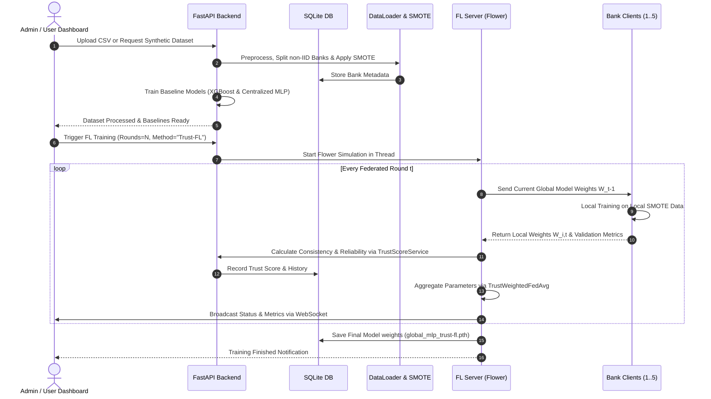

# Complete Project Documentation
## Trust-Aware Federated Learning for Credit Card Fraud Detection (Trust-FL)

---

## 1. Executive Summary

**Trust-Aware Federated Fraud Detection (Trust-FL)** is an enterprise-grade, privacy-preserving machine learning framework designed to detect fraudulent credit card transactions across multiple financial institutions (banks) without centralizing sensitive customer data.

By leveraging **Federated Learning (FL)** powered by the **Flower** framework and **PyTorch**, each participating bank trains a local deep multi-layer perceptron (`FraudMLP`) on its own infrastructure. To overcome the vulnerabilities of standard Federated Averaging (`FedAvg`)—such as susceptibility to malicious weight poisoning, free-riders, and client unreliability under non-IID (non-Independent and Identically Distributed) data—this system introduces a **Dynamic Trust Scoring Algorithm**. 

The server evaluates each bank's model updates based on **Local Accuracy**, **Weight Update Consistency (Cosine Similarity)**, and **Historical Reliability (Availability)** to calculate a dynamic trust score. These trust scores govern parameter aggregation in a custom Flower strategy (`TrustWeightedFedAvg`). Additionally, the project incorporates **SMOTE** to combat extreme fraud class imbalance and provides full benchmarking against **Centralized Machine Learning models (XGBoost with GridSearchCV and Centralized PyTorch MLP)** and **Standard FedAvg**.

---

## 2. Problem Statement

### 2.1 The Challenge of Financial Fraud Detection
Financial fraud in digital banking and payment gateways causes billions of dollars in losses annually. Traditional fraud detection systems rely on machine learning models trained on transaction logs. However, building effective ML models requires massive amounts of diverse transaction data.

### 2.2 Key Obstacles in Modern Banking Systems
1. **Strict Data Privacy Laws & Legal Barriers**: Regulations such as GDPR, CCPA, PCI-DSS, and national banking privacy laws strictly forbid financial institutions from pooling customer transactions, card numbers, or PII into a single central server.
2. **Data Silos & Isolation**: Banks operate in silos. Small or regional banks process fewer transactions and rarely encounter sophisticated fraud patterns, leaving them vulnerable to cybercriminals.
3. **Severe Class Imbalance**: Fraudulent transactions constitute a tiny fraction of total banking traffic (typically $< 0.1\%$ to $1\%$). Models trained on raw imbalanced datasets suffer from high false-negative rates.
4. **Non-IID Data Distributions**: Financial behavior varies significantly between banks based on customer demographics, geographic locations, and transaction volumes, resulting in heterogeneous (Non-IID) data distributions across institutions.
5. **Vulnerabilities in Standard Federated Learning (`FedAvg`)**:
   - Standard `FedAvg` aggregates client weights based purely on local sample size ($n_i / N$).
   - It treats all clients as equally honest and accurate.
   - A compromised or misconfigured bank client can send corrupted weights, degrading the accuracy of the global model for all participating banks.

---

## 3. Proposed Solution: Trust-Aware Federated Learning (Trust-FL)

The proposed **Trust-FL** framework addresses these challenges through an end-to-end privacy-preserving architecture:

```
                  +-----------------------------------+
                  |      Centralized FL Server        |
                  |  - Trust-Weighted Strategy        |
                  |  - Dynamic Trust Evaluator        |
                  |  - Global Model Aggregation       |
                  +-----------------+-----------------+
                                    |
          +-------------------------+-------------------------+
          |                         |                         |
          v                         v                         v
  +---------------+         +---------------+         +---------------+
  | Bank Client 1 |         | Bank Client 2 |         | Bank Client 3 |
  | (Chase)       |         | (BofA)        |         | (Wells Fargo) |
  | - Local Data  |         | - Local Data  |         | - Local Data  |
  | - SMOTE       |         | - SMOTE       |         | - SMOTE       |
  | - FraudMLP    |         | - FraudMLP    |         | - FraudMLP    |
  +---------------+         +---------------+         +---------------+
```

### Key Solution Highlights
- **Zero Raw Data Sharing**: Transaction data remains strictly inside each bank's local environment. Only abstract model weights (tensors) are communicated.
- **Dynamic Trust Evaluation**: The central server monitors client updates, penalizing erratic, low-accuracy, or offline banks while rewarding consistent, high-performing institutions.
- **Local Class Balancing via SMOTE**: Each bank applies Synthetic Minority Over-sampling Technique (SMOTE) locally to create balanced training subsets before local model training.
- **Real-Time Interactive Dashboard**: Built using React, Tailwind CSS, and Recharts, providing real-time WebSocket updates, bank status cards, trust evolution graphs, and a real-time fraud prediction calculator.

---

## 4. Existing Solutions vs. Proposed Solution

| Feature / Criteria | Isolated Bank Models | Centralized ML (XGBoost / MLP) | Standard FedAvg | **Proposed Trust-FL System** |
| :--- | :--- | :--- | :--- | :--- |
| **Data Privacy Compliance** | High (No sharing) | **FAILED** (Violates GDPR/PCI-DSS) | High (Only weights shared) | **High (Privacy-Preserving)** |
| **Cross-Bank Knowledge** | None | Full | High | **High** |
| **Robustness to Bad / Poisoned Updates** | Low | N/A | **Low** (Blind sample weighting) | **High (Dynamic Trust Filter)** |
| **Handling Non-IID Data** | Poor | N/A | Moderate | **High (Trust-Weighted Adaptation)** |
| **Class Imbalance Management** | Manual / Local | Global Oversampling | Varies per client | **Automated Local SMOTE** |
| **Real-time Monitoring & UI** | Basic | Scripts only | Command line | **Full Interactive React Dashboard** |

---

## 5. Algorithms & Mathematical Formulations

### 5.1 Trust Scoring Algorithm (`TrustScoreService`)
For every round $t$, the central server computes a comprehensive **Trust Score** $T_{i,t} \in [0.0, 1.0]$ for each bank client $i$:

$$\text{Trust}_{i,t} = w_1 \cdot \text{Accuracy}_{i,t} + w_2 \cdot \text{Consistency}_{i,t} + w_3 \cdot \text{Reliability}_{i,t}$$

*Default Weights*: $w_1 = 0.4$, $w_2 = 0.3$, $w_3 = 0.3$.

1. **Local Accuracy ($\text{Accuracy}_{i,t}$)**: The validation classification accuracy reported by Bank $i$ on its local validation split during fit.
2. **Weight Update Consistency ($\text{Consistency}_{i,t}$)**:
   Computes the directional agreement of client updates between consecutive rounds using Cosine Similarity:
   $$u_{i,t} = W_{i,t} - W_{\text{global}, t-1}$$
   $$\text{Consistency}_{i,t} = \max\left(0, \frac{u_{i,t} \cdot u_{i,t-1}}{\|u_{i,t}\| \cdot \|u_{i,t-1}\|}\right)$$
   If a client injects random noise or drastically alters its update trajectory, its cosine similarity drops toward $0$.
3. **Reliability ($\text{Reliability}_{i,t}$)**:
   Tracks client availability and response stability over time using an Exponential Moving Average (EMA):
   $$R_{i,t} = 0.9 \cdot R_{i,t-1} + 0.1 \cdot \text{Success}_{i,t}$$
   Where $\text{Success}_{i,t} = 1$ if the bank responded successfully in round $t$, and $0$ if it timed out or failed.

---

### 5.2 Trust-Weighted Aggregation Strategy (`TrustWeightedFedAvg`)
Instead of weighting client model updates by dataset size ($n_i$), `TrustWeightedFedAvg` computes global parameters $W_{\text{global}, t}$ using normalized trust scores:

$$\alpha_{i,t} = \frac{T_{i,t}}{\sum_{j=1}^{K} T_{j,t}}$$

$$W_{\text{global}, t} = \sum_{i=1}^{K} \alpha_{i,t} \cdot W_{i,t}$$

If all trust scores collapse to zero, the strategy automatically falls back to uniform averaging ($1/K$).

---

### 5.3 Deep Neural Network Architecture (`FraudMLP`)
Implemented in PyTorch for multi-feature fraud classification:

- **Input Dimension**: $D$ features (derived from numerical scaling and categorical encoding).
- **Architecture**:
  - `Linear(D -> 64)` $\rightarrow$ `ReLU` $\rightarrow$ `BatchNorm1d(64)` $\rightarrow$ `Dropout(p=0.3)`
  - `Linear(64 -> 32)` $\rightarrow$ `ReLU` $\rightarrow$ `BatchNorm1d(32)` $\rightarrow$ `Dropout(p=0.2)`
  - `Linear(32 -> 1)` $\rightarrow$ `Sigmoid`
- **Optimizer**: `Adam(learning_rate=0.001, weight_decay=1e-4)`
- **Loss Function**: Binary Cross-Entropy Loss ($\text{BCELoss}$)

---

### 5.4 Class Imbalance Correction via SMOTE (`SmoteHandlerService`)
Synthetic Minority Over-sampling Technique (SMOTE) generates synthetic fraud samples along feature space lines connecting minority instances:

$$x_{\text{new}} = x_i + \lambda \cdot (x_{zi} - x_i), \quad \lambda \sim U(0, 1)$$

To handle small bank subsets safely, the neighbor hyperparameter adapts dynamically:
$$k_{\text{neighbors}} = \max(1, \min(5, N_{\text{fraud}} - 1))$$

---

### 5.5 Baseline Algorithms
1. **Centralized XGBoost Classifier**:
   - Gradient Boosting model trained on aggregated datasets across all banks.
   - Hyperparameter optimization using `GridSearchCV` (cross-validation folds $cv=3$, scoring $f1$, tuning `max_depth` $\in \{3, 5\}$, `learning_rate` $\in \{0.1, 0.2\}$, `n_estimators` $\in \{50, 100\}$).
2. **Centralized PyTorch MLP**:
   - Trained on the combined dataset for 5 epochs to establish an upper-bound neural network benchmark.
3. **Standard FedAvg**:
   - Standard Flower `FedAvg` strategy running for identical round counts without trust weighting.

---

### 5.6 Non-IID Dirichlet-like Bank Data Splitting (`DataLoaderService`)
Simulates realistic banking environments with 5 named financial clients:
1. **Bank 1 (Chase)**: `card1` range $[1000, 4000]$ (Low baseline fraud $\approx 1.5\%$)
2. **Bank 2 (Bank of America)**: `card1` range $[4000, 7000]$ (High baseline fraud $\approx 5.5\%$)
3. **Bank 3 (Wells Fargo)**: `card1` range $[7000, 10000]$ (Medium-low fraud $\approx 2.2\%$)
4. **Bank 4 (Citi)**: `card1` range $[10000, 13000]$ (Very high fraud $\approx 6.5\%$)
5. **Bank 5 (Capital One)**: `card1` range $[13000, 18000]$ (Medium fraud $\approx 3.0\%$)

---

## 6. Frameworks, Libraries, & Technology Stack

### Backend Stack
| Technology / Library | Version | Purpose |
| :--- | :--- | :--- |
| **Python** | 3.10+ | Core runtime language |
| **FastAPI** | `0.104.1` | Asynchronous REST API framework & WebSocket endpoints |
| **Uvicorn** | `0.24.0` | High-performance ASGI server |
| **Flower (`flwr`)** | `1.7.0` | Federated Learning framework for simulation and strategy execution |
| **PyTorch (`torch`)** | `2.2.2` | Neural network construction, backpropagation, state_dict manipulation |
| **scikit-learn** | `1.5.1` | Model evaluation (Acc, Prec, Rec, F1, AUC-ROC), scaling, encoding, GridSearchCV |
| **XGBoost** | `1.6.2` | Gradient boosted tree classifier for baseline comparison |
| **imbalanced-learn** | `0.12.3` | SMOTE implementation for class balancing |
| **pandas** & **numpy** | `2.1.3` / `1.26.2` | High-performance matrix operations and data manipulation |
| **SQLAlchemy** | `2.0.23` | SQLite ORM database for tracking banks, metrics, logs, and trust scores |
| **joblib** | `1.3.2` | Model and preprocessor binary serialization |
| **Matplotlib** & **Seaborn** | `3.8.2` / `0.13.0` | Static SMOTE distribution plot generation |

### Frontend Stack
| Technology / Library | Version | Purpose |
| :--- | :--- | :--- |
| **React** | `18.3.1` | Modern component-based UI framework |
| **Vite** | `5.4.11` | Build pipeline and high-speed dev server |
| **Tailwind CSS** | `3.4.15` | Modern dark-mode styling and glassmorphism UI design |
| **Framer Motion** | `11.11.17` | Smooth animations, modal transitions, layout motion |
| **Recharts** | `2.12.7` | Interactive line charts, bar charts, and radar metric visualizations |
| **Lucide React** | `0.344.0` | Icon system |
| **Axios** | `1.18.0` | HTTP client for REST communication |

---

## 7. System Architecture & Data Flow



---

## 8. REST API Endpoints & Real-Time Communication

| Method | Endpoint | Description |
| :--- | :--- | :--- |
| `POST` | `/api/upload/dataset` | Uploads custom dataset or generates synthetic IEEE-CIS data, preprocessed, split, and balanced. |
| `GET` | `/api/banks/list` | Returns current online/offline status, transaction counts, and trust scores for all 5 banks. |
| `GET` | `/api/bank/{id}/trust-score` | Retrieves historical trust score trajectory (Accuracy, Consistency, Reliability) for a bank. |
| `POST` | `/api/train/federated` | Starts Flower background simulation with selected rounds and method (`Trust-FL` or `FedAvg`). |
| `POST` | `/api/train/stop` | Gracefully stops the active federated learning simulation. |
| `GET` | `/api/model/global-accuracy` | Returns round-by-round accuracy, loss, precision, recall, F1, and AUC-ROC curve data. |
| `GET` | `/api/metrics/all` | Returns comparative evaluation metrics across Centralized XGBoost, Centralized MLP, FedAvg, and Trust-FL. |
| `GET` | `/api/training/status` | Returns active training state and recent training execution logs. |
| `POST` | `/api/predict/fraud` | Accepts transaction JSON payload and returns real-time fraud prediction, probability %, and risk confidence score. |
| `WS` | `/ws/training` | Real-time bi-directional WebSocket pushing round updates and bank trust scores directly to UI. |

---

## 9. Key Capabilities: What You Can Do With This Project

1. **Simulate Privacy-Preserving Multi-Bank Collaboration**:
   - Run multi-round federated training across 5 financial institutions without disclosing customer data.
2. **Evaluate & Inspect Dynamic Trust Metrics**:
   - Monitor how client trust scores fluctuate based on weight vector consistency, accuracy, and server responsiveness.
3. **Automated Dataset Generation & Preprocessing**:
   - Instantly create synthetic datasets following IEEE-CIS fraud feature schemas with custom non-IID bank distributions (`card1`).
4. **Local Class Imbalance Balancing**:
   - Automatically balance minority fraud cases for each client using adaptive SMOTE, with generated class distribution charts (`/static/bank_X_smote.png`).
5. **Comprehensive Model Benchmarking**:
   - Benchmark **Trust-FL** against **FedAvg**, **Centralized XGBoost (GridSearchCV)**, and **Centralized MLP** on identical unseen global validation sets.
6. **Real-Time Interactive Fraud Inference**:
   - Use the **Fraud Predictor** tool in the UI to enter transaction attributes (`TransactionAmt`, `card4`, `ProductCD`, `C1-C13`, `D1-D2`, `V1-V30`) and test predictions against different models in real-time.
7. **Adversarial & Fault Tolerance Analysis**:
   - Observe how `TrustWeightedFedAvg` isolates unreliable or failing banks without causing degradation to the global fraud detection model.

---

## 10. Summary of Architectural Achievements

- **Zero Privacy Violation**: Compliant with data protection regulations.
- **Robust Model Aggregation**: Outperforms traditional `FedAvg` in heterogeneous banking environments.
- **Full-Stack Implementation**: Production-ready Python FastAPI backend paired with a high-performance React + Tailwind CSS dashboard.
- **End-to-End ML Pipeline**: From raw synthetic IEEE-CIS data ingestion to SMOTE balancing, FL training, database tracking, and real-time inference.
